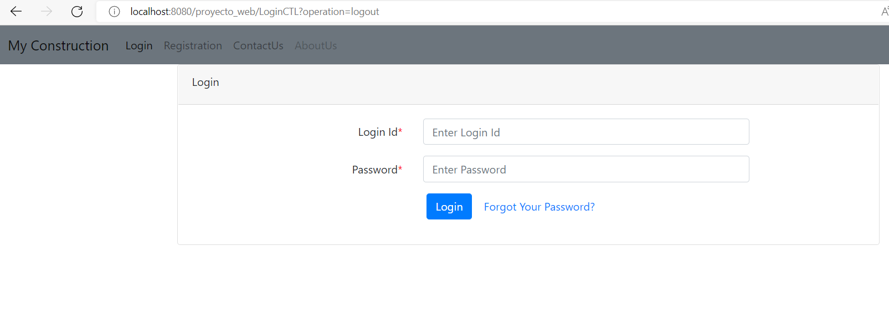

# java-web-app-login-mysql

_Se realiza proyecto MAVEN JAVA, que levanta WEB con Login conectado a Base de Datos Mysql._

## Comenzando 🚀

_Estas instrucciones te permitirán obtener una copia del proyecto en funcionamiento en tu máquina local para propósitos de desarrollo y pruebas._

### Pre-requisitos 📋

```
- JDK 1.8 para levantar el proyecto principal en Java
- docker/docker-compose para levantar las BDs Mysql
```


### Instalación 🔧

_Paso 1: levantar servicio mysql, verificar que se encuentra libre el puerto 8082-3307_

```
docker-compose up -d
```

_Paso 2: ingresar al Administrador de la BD http://localhost:8082/ (root/root), seleccionar "datosjavawebapp" y crear tabla_

```
CREATE TABLE `javawebapp`.`user` (
  `id` INT NOT NULL,
  `fname` VARCHAR(45) NULL,
  `lname` VARCHAR(45) NULL,
  `login` VARCHAR(45) NULL,
  `password` VARCHAR(45) NULL,
  `dob` DATE NULL,
  `mobile` VARCHAR(45) NULL,
  PRIMARY KEY (`id`));
```

_Paso 3: insertar datos de usuarios_

```
INSERT INTO `user` (`id`, `fname`, `lname`, `login`, `password`, `dob`, `mobile`) VALUES
(1, 'gustavo', 'chavez', 'gchavez', '1234', '1983-03-20', 'gg_chavez@hotmail.'),
(2, 'roberto', 'bolagno', 'rbolagno', '1234', '1981-09-12', '98989898');
```

_Paso 4: levantar proyecto java y acceder al local http://localhost:8080/proyecto_web/_





## Construido con 🛠️

_las siguientes herramientas_

- JDK 8
- Mysql (Docker mysql/mysql-server:5.6.25)
- Docker/Docker-compose

## Autor ✒️

- **Gustavo Chavez** - _Todas las tareas_ - [ggchavez-hotmail](https://github.com/ggchavez-hotmail/)

